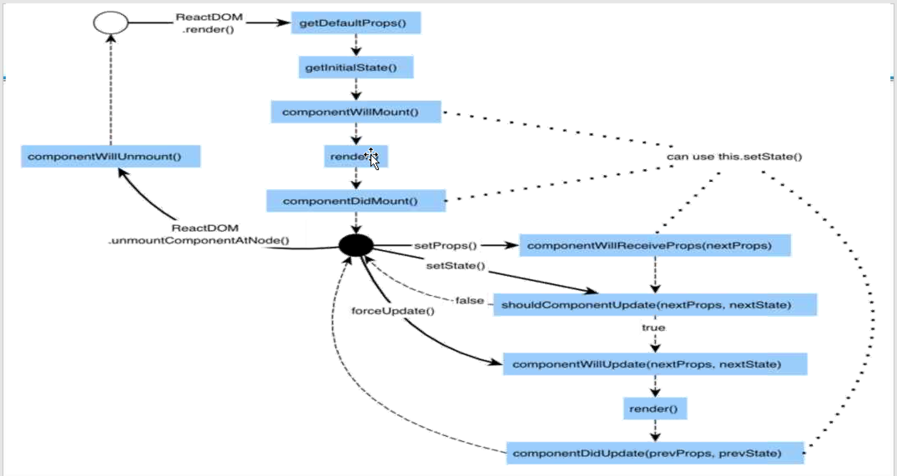

1. do npm init

2. install babel and babel-cli globally. Babel is the compiler to compile the ES6 code to ES5.
    > `npm install -g babel babel-cli`

3. install webpack and webpac-dev-server as dedency or local modules
    > `npm install --save webpack`
    > `npm install --save webpack-dev-server`

4. install react and react-dom as dependency/local modules
    > `npm install --save react`
    > `npm install --save reac-dom`

5. install babel-core babel-loader babel-preset-react babel-preset-es2015
    > `npm install --save-dev babel-core`
    > `npm install --save-dev babel-loader`
    > `npm install --save-dev babel-preset-react`
    > `npm install --save-dev babel-preset-es2015`

6. create index.html, App.jsx, main.js and webpack.config.js files
    > `touch index.html`
    > `touch App.jsx`
    > `touch main.js`
    > `touch webpack.config.js`

7. Configure webpack
    a. input
        a. entry
    b. output
        a. path
        b. filename
    c. devServer
        a. inlineDev
        b. port
    d. modules
        a. loaders

8. Components
    Stateless
    Statefull

    // Create a component named MessageComponent
    ```javascript
    var MessageComponent = React.createClass({
    render: function() {
        return (
        <div><h1> Hello World</h1></div>
        );
    }
    });
    // Render an instance of MessageComponent into document.body
    ReactDOM.render(
    <MessageComponent/>, document.body
    );
    ```

    #### Components can be created in two ways
    *React.createClass*
    ```javascript
    import React from 'react';
    const Contacts = React.createClass({
        render() {
            return (
                <div></div>
            )
        }
    })

    export default contacts
    ```

    *React.Component*
    ```javascript
    import React from 'react';
    class Contacts extends React.Component {
        constructor(props){
            super(props);
        }
        render () {
            return (
                <div></div>
            );
        }
    }

    export default Contacts;
    ```

9. Component Life Cycle methods. We should be ware of methods that will be triggered for below scenarios,

    Initial Render
        getDefaultProps
        getInitialState
        componentWillMount
        render
        componentDidMount
    Props Change
        componentWillReceiveProps
        shouldComponentUpdate
        componentWillUpdate
        render
        componentDidUpdate
    State Change
        shouldComponentUpdate
        componentWillUpdate
        render
        componentDidUpdate
    Component Unmount
        componentWillUnmount

    

10. 